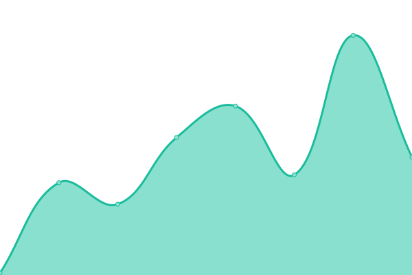
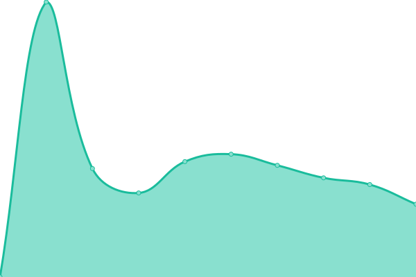

# [📈 Live Status](https://upptime.github.io/upptime): <!--live status--> **🟩 All systems operational**

This repository contains the open-source uptime monitor and status page for [Upptime](https://upptime.js.org), powered by [Upptime](https://github.com/upptime/upptime).

<!--start: status pages-->
<!-- This summary is generated by Upptime (https://github.com/upptime/upptime) -->
<!-- Do not edit this manually, your changes will be overwritten -->
<!-- prettier-ignore -->
| URL | Status | History | Response Time | Uptime |
| --- | ------ | ------- | ------------- | ------ |
|  [My socials](https://vasilvestre.github.io/) | 🟩 Up | [my-socials.yml](https://github.com/vasilvestre/status/commits/HEAD/history/my-socials.yml) | 

 80ms
     
 | 

<a href="https://vasilvestre.github.io/status/history/my-socials">100.00%</a>
    

|  [Company I work at](https://www.akawaka.fr/) | 🟩 Up | [company-i-work-at.yml](https://github.com/vasilvestre/status/commits/HEAD/history/company-i-work-at.yml) | 

 263ms
     
 | 

<a href="https://vasilvestre.github.io/status/history/company-i-work-at">100.00%</a>
    

|  [Client website](https://www.smsp.fr/) | 🟩 Up | [client-website.yml](https://github.com/vasilvestre/status/commits/HEAD/history/client-website.yml) | 

 1575ms
     
 | 

<a href="https://vasilvestre.github.io/status/history/client-website">100.00%</a>
    

|  [Second client website](https://www.dumont-securite.fr/) | 🟩 Up | [second-client-website.yml](https://github.com/vasilvestre/status/commits/HEAD/history/second-client-website.yml) | 

 2858ms
     
 | 

<a href="https://vasilvestre.github.io/status/history/second-client-website">100.00%</a>
    

<!--end: status pages-->

[**Visit my status website →**](https://vasilvestre.github.io/status/)

## 📄 License

- Powered by: [Upptime](https://github.com/upptime/upptime)
- Code: [MIT](./LICENSE) © [Upptime](https://upptime.js.org)
- Data in the `./history` directory: [Open Database License](https://opendatacommons.org/licenses/odbl/1-0/)
