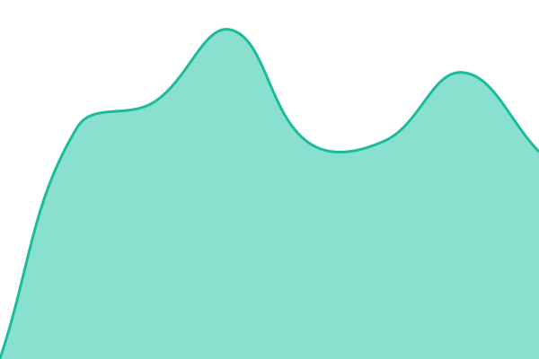
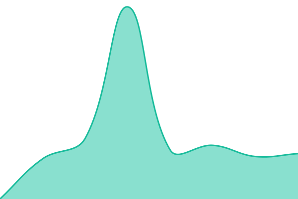

# [📈 Live Status](https://upptime.github.io/upptime): <!--live status--> **🟩 All systems operational**

This repository contains the open-source uptime monitor and status page for [Upptime](https://upptime.js.org), powered by [Upptime](https://github.com/upptime/upptime).

<!--start: status pages-->
<!-- This summary is generated by Upptime (https://github.com/upptime/upptime) -->
<!-- Do not edit this manually, your changes will be overwritten -->
<!-- prettier-ignore -->
| URL | Status | History | Response Time | Uptime |
| --- | ------ | ------- | ------------- | ------ |
|  [My socials](https://vasilvestre.github.io/) | 🟩 Up | [my-socials.yml](https://github.com/vasilvestre/status/commits/HEAD/history/my-socials.yml) | 

 141ms
     
 | 

<a href="https://vasilvestre.github.io/status/history/my-socials">100.00%</a>
    

|  [Cats](https://cataas.com/) | 🟩 Up | [cats.yml](https://github.com/vasilvestre/status/commits/HEAD/history/cats.yml) | 

 731ms
     
 | 

<a href="https://vasilvestre.github.io/status/history/cats">100.00%</a>
    

|  [Akawaka](https://www.akawaka.fr/) | 🟩 Up | [akawaka.yml](https://github.com/vasilvestre/status/commits/HEAD/history/akawaka.yml) | 

 1172ms
     
 | 

<a href="https://vasilvestre.github.io/status/history/akawaka">100.00%</a>
    

|  [SMSP](https://www.smsp.fr/) | 🟩 Up | [smsp.yml](https://github.com/vasilvestre/status/commits/HEAD/history/smsp.yml) | 

 1524ms
     
 | 

<a href="https://vasilvestre.github.io/status/history/smsp">100.00%</a>
    

|  [Dumont securite](https://www.dumont-securite.fr/) | 🟩 Up | [dumont-securite.yml](https://github.com/vasilvestre/status/commits/HEAD/history/dumont-securite.yml) | 

 1560ms
     
 | 

<a href="https://vasilvestre.github.io/status/history/dumont-securite">100.00%</a>
    

|  [Home Assistant](https://vasilvestre.duckdns.org:8123/) | 🟩 Up | [home-assistant.yml](https://github.com/vasilvestre/status/commits/HEAD/history/home-assistant.yml) | 

 514ms
     
 | 

<a href="https://vasilvestre.github.io/status/history/home-assistant">100.00%</a>
    

|  [Custom website for Dart tournament](https://dartiti.vercel.app/leaderboard) | 🟩 Up | [custom-website-for-dart-tournament.yml](https://github.com/vasilvestre/status/commits/HEAD/history/custom-website-for-dart-tournament.yml) | 

 2962ms
     
 | 

<a href="https://vasilvestre.github.io/status/history/custom-website-for-dart-tournament">100.00%</a>
    

<!--end: status pages-->

[**Visit my status website →**](https://vasilvestre.github.io/status/)

## 📄 License

- Powered by: [Upptime](https://github.com/upptime/upptime)
- Code: [MIT](./LICENSE) © [Upptime](https://upptime.js.org)
- Data in the `./history` directory: [Open Database License](https://opendatacommons.org/licenses/odbl/1-0/)
